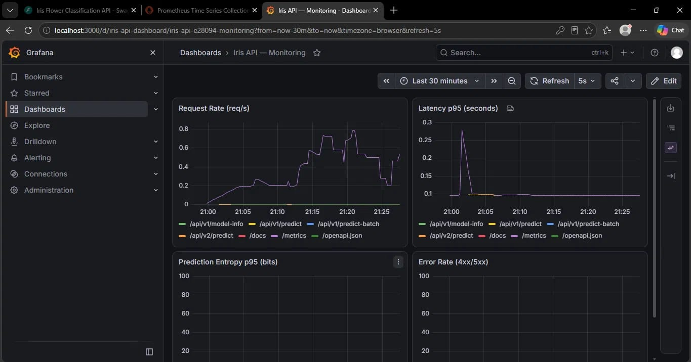

# Iris Flower Classification API

## Description

A REST API that predicts Iris flower species (Setosa, Versicolor,
Virginica) from sepal/petal measurements. Built to demonstrate
production API engineering — validation, error handling, structured
logging, versioning, configuration management, containerization,
monitoring, load testing, and deployment — rather than model complexity.

- **Model:** Random Forest Classifier (scikit-learn)
- **Stack:** FastAPI, Pydantic, Uvicorn, Docker, Prometheus, Grafana, pytest

## Architecture

```
                         ┌──────────────────────────────────────┐
  curl / Postman / ────► │ FastAPI (Uvicorn)                    │
  frontend / browser     │ request_id middleware                │
                         │ CORS                                 │
                         │ Pydantic validation                  │
                         └───────────────┬──────────────────────┘
                                         │
                         ┌───────────────▼──────────────────────┐
                         │ app/inference.py                     │
                         │ model.predict_proba()                │
                         │ loaded once at startup               │
                         └───────────────┬──────────────────────┘
                                         │
                    ┌────────────────────┼────────────────────┐
                    ▼                    ▼                    ▼
             JSON response       Structured logs      Prometheus metrics
             to client           console + file        /metrics
                                                         │
                                                         ▼
                                      ┌──────────────────────────────┐
                                      │ Prometheus (local)           │
                                      │ scrapes /metrics every 5s    │
                                      └──────────────┬───────────────┘
                                                     │
                                                     ▼
                                      ┌──────────────────────────────┐
                                      │ Grafana (local)              │
                                      │ auto-provisioned dashboard   │
                                      └──────────────────────────────┘
```

---

## Deployment

**Live API:** https://iris-flower-classification-api-gf1c.onrender.com/docs

Deployed as a standalone Docker container on **Render** (free tier). The
service spins down after 15 minutes of inactivity — the first request
after a quiet period may take up to a minute to wake it up; every
request after that is fast.

Prometheus and Grafana are not deployed publicly — they run locally via
`docker compose up`, alongside a **local** copy of the API (Option B
below), not the live Render deployment. This is deliberate: Render's
free tier has an ephemeral filesystem, so file-based logs
(`logs/app.log`) written there are lost on every restart and can't be
inspected. Running the full stack locally keeps logs on disk and makes
the whole request → log → metric → dashboard flow fully inspectable in
one place, while the deployed API stays a small, reliably free,
standalone service.

---

## Setup

**Prerequisites:** Python 3.11+, `git`, and (for Option B only) Docker
Desktop.

### Option A — API only (fastest way to try it locally)

```bash
git clone https://github.com/GMKayalvizhi/Iris-flower-classification-API.git
cd Iris-flower-classification-API

python -m venv venv
venv\Scripts\activate        # Windows
# source venv/bin/activate   # macOS/Linux

pip install -r requirements.txt

copy .env.example .env       # Windows
# cp .env.example .env       # macOS/Linux
```

Open `.env` and set `API_KEY` to any value you choose:
```bash
python -c "import secrets; print(secrets.token_hex(16))"
```
Copy the printed string into `.env`, replacing the `API_KEY=` line, e.g.
`API_KEY=<paste-the-generated-value-here>`.

```bash
uvicorn app.main:app --reload
```

Leave this terminal running — don't close it or stop the server.
 
Open **http://127.0.0.1:8000/docs** in your browser — click
**Authorize**, paste your `API_KEY`, and try every endpoint directly
from there. This also confirms the server is actually reachable.
 
Then, in a **second, separate terminal** (with the server from above
still running in the first one) — set `API_KEY` first, because `test_integration.py` 
sends real HTTP requests to the running server rather than bypassing security
like the other tests do, so it needs the actual `API_KEY` to get past
authentication, same as any real client:
```bash
$env:API_KEY="<your-key>"; pytest -v        # Windows PowerShell
API_KEY=<your-key> pytest -v                # macOS/Linux
```
 
If you'd rather run only the tests that don't need a server or a key
at all, use:
```bash
pytest -v --ignore=tests/test_integration.py
```
If `pytest -v` shows connection errors on the integration tests, the
server has stopped running in the first terminal — start it again and
keep that terminal open while you run tests in the second one.

### Option B — Full stack: API + Prometheus + Grafana together

Requires Docker Desktop and the Docker engine should be running.
 
```bash
copy .env.example .env        # Windows
# cp .env.example .env        # macOS/Linux
```
Set your real `API_KEY` in `.env`.
 
Create your own `prometheus_api_key.txt` from the example file, then
edit it to contain only your real key (no comments, no quotes):
```bash
copy prometheus_api_key_example.txt prometheus_api_key.txt   # Windows
# cp prometheus_api_key_example.txt prometheus_api_key.txt  # macOS/Linux
```
`prometheus_api_key.txt` is git-ignored — you're creating it locally,
it's never committed. Use the **same** key value as `.env`, since this
is what lets Prometheus authenticate against the protected `/metrics`
endpoint.

```bash
docker compose up --build
```

- **API:** http://localhost:8000/docs
- **Prometheus:** http://localhost:9090 (Status → Targets should show `iris-api` as `UP`)
- **Grafana:** http://localhost:3000 — dashboard loads automatically
  - Username: `admin`
  - Password: `admin`

**To stop:** `docker compose down`

---

## API Reference — Example Requests for Every Endpoint

All endpoints require an `X-API-Key` header except `/api/v1/health`.
Examples use `http://localhost:8000` (after `docker compose up` or
`uvicorn app.main:app --reload`). Swap in the live URL to test the
deployed instance instead:
https://iris-flower-classification-api-gf1c.onrender.com

### `GET /api/v1/health` — no key required
```bash
curl http://localhost:8000/api/v1/health
```
```json
{"status": "ok", "model_loaded": true}
```

### `POST /api/v1/predict`
```bash
curl -X POST http://localhost:8000/api/v1/predict \
  -H "X-API-Key: your-key-here" \
  -H "Content-Type: application/json" \
  -d '{"sepal_length": 5.1, "sepal_width": 3.5, "petal_length": 1.4, "petal_width": 0.2}'
```
```json
{"prediction": "setosa", "confidence": 1.0, "model_version": "1.0.0", "request_id": "eae99247-..."}
```

### `POST /api/v2/predict` — adds a full probability breakdown
```bash
curl -X POST http://localhost:8000/api/v2/predict \
  -H "X-API-Key: your-key-here" \
  -H "Content-Type: application/json" \
  -d '{"sepal_length": 5.1, "sepal_width": 3.5, "petal_length": 1.4, "petal_width": 0.2}'
```
```json
{
  "prediction": "setosa",
  "confidence": 1.0,
  "probabilities": {"setosa": 1.0, "versicolor": 0.0, "virginica": 0.0},
  "model_version": "1.0.0",
  "request_id": "a1b2c3d4-..."
}
```

### `POST /api/v1/predict-batch`
```bash
curl -X POST http://localhost:8000/api/v1/predict-batch \
  -H "X-API-Key: your-key-here" \
  -H "Content-Type: application/json" \
  -d '{"inputs": [{"sepal_length": 5.1, "sepal_width": 3.5, "petal_length": 1.4, "petal_width": 0.2}]}'
```
```json
{"predictions": [{"prediction": "setosa", "confidence": 1.0}], "count": 1, "model_version": "1.0.0", "request_id": "a8a8cff5-..."}
```

### `POST /api/v2/predict-batch` — same request shape, adds probabilities per item
```bash
curl -X POST http://localhost:8000/api/v2/predict-batch \
  -H "X-API-Key: your-key-here" \
  -H "Content-Type: application/json" \
  -d '{"inputs": [{"sepal_length": 5.1, "sepal_width": 3.5, "petal_length": 1.4, "petal_width": 0.2}]}'
```
```json
{"predictions": [{"prediction": "setosa", "confidence": 1.0, "probabilities": {"setosa": 1.0, "versicolor": 0.0, "virginica": 0.0}}], "count": 1, "model_version": "1.0.0", "request_id": "b2c3d4e5-..."}
```

### `GET /api/v1/model-info`
```bash
curl http://localhost:8000/api/v1/model-info \
  -H "X-API-Key: your-key-here"
```
Returns `model_type`, `model_version`, `trained_on`, `feature_names`,
`target_names`, `n_estimators`, `test_accuracy`.

### `GET /metrics` — Prometheus format, key-protected
```bash
curl http://localhost:8000/metrics \
  -H "X-API-Key: your-key-here"
```
Returns HTTP metrics plus a custom metric, `iris_prediction_entropy_bits`
— the model's uncertainty on each prediction.

**Errors** (422 validation, 401 auth, 400/500 server) all include a
`request_id` for tracing, without exposing internal details.

---

## Independent Extension: Grafana Dashboard

Beyond the guided tasks, I built a Grafana dashboard on top of the
Prometheus metrics from Task 18 — fully provisioned as code
(`grafana/provisioning/`), so `docker compose up` produces the exact
same working dashboard automatically, with no manual setup.



Four panels: request rate by endpoint, p95 latency, p95 prediction
entropy by API version, and error rate. This was chosen because the
Prometheus/entropy monitoring work from Task 18 was already in place —
a dashboard turns those raw metrics into something readable at a
glance, and it's a stronger demonstration of the monitoring story than
a written description alone.

---

## Testing

Full investigation in **[TESTING.md](TESTING.md)**. Summary: unit +
integration tests, plus a load test (50/100/200 concurrent users) that
found and fixed a real performance bug — misconfigured worker processes
combined with math-library thread oversubscription. Fixed by matching
worker count to available CPU cores and forcing single-threaded math
libraries: a 3–15x latency improvement, 0% failures throughout.

```bash
pytest -v --ignore=tests/test_integration.py
$env:API_KEY="<your-key>"; pytest tests/test_integration.py -v   # against a running container
locust -f locustfile.py --host http://localhost:8000 --users 100 --spawn-rate 10 --run-time 60s --headless
```

---

## What I Learned

Building this end to end, task by task, is what actually made these ideas
concrete rather than theoretical:

- **A model is not a product.** `model.predict()` in a notebook and a
  service other programs can safely call over the internet are two
  completely different engineering problems — validation, error handling,
  logging, and versioning are most of the actual work.
- **Separating training from serving matters.** The model is trained and
  saved once, then loaded at startup and reused for every request — never
  retrained or reloaded per call. That distinction seems obvious in
  hindsight, but it shapes almost everything downstream: batching,
  latency, and what actually needs to be fast.
- **Validation is the real safety net.** Pushing every rule (types,
  ranges, `extra="forbid"`) into Pydantic schemas means bad data never
  reaches the model at all, and the API can never crash on malformed
  input — it fails predictably with a 422 instead.
- **A `request_id` is what makes logs usable, not just present.** Logging
  everything is easy; logging it so one specific request's full story can
  be traced through validation, inference, and the response is a
  different, more deliberate habit.
- **Configuration should have working defaults.** Centralizing settings
  through `pydantic-settings`, with every value defaulting to something
  sane, meant the app never depended on a perfectly-set-up environment to
  simply run.
- **Vectorize once, not per row.** Running inference on a whole batch in
  a single call instead of looping was a small code change with a real
  performance reason behind it — and the same helper serving both a
  single prediction and a full batch meant that fix applied everywhere
  automatically.
- **Versioning has to be provably non-breaking, not just believed to be.**
  Writing tests that feed v2-shaped data into v1's schema and assert
  rejection was more convincing than any amount of manual checking.
- **Security should be structural, not per-endpoint.** Applying the API
  key check at the router level, not endpoint by endpoint, meant a new
  route couldn't accidentally ship unprotected.
- **Observability is a design decision, not an afterthought.** Choosing
  prediction entropy over a simpler per-class counter meant thinking
  about *what failure actually looks like* for this specific model,
  not just wiring up whatever metric was easiest.
- **A dashboard and an alert should watch the same data.** Building the
  Grafana dashboard on top of the exact same Prometheus metric the alert
  rule already used, instead of inventing new numbers, kept the two
  consistent with each other by construction.
- **"0% failures" doesn't mean "no problem."** Load testing surfaced a
  real bug — silent, severe latency growth under concurrency — that every
  passing unit test had completely missed, because unit tests can't see
  concurrency at all. Finding it took measurement, not guessing: timing
  logs, CPU stats, and testing one change at a time until the actual
  cause (thread oversubscription, not enough workers) was clear.
- **Knowing where a fix stops being possible is its own skill.** After
  fixing the real bug, load stayed high at higher concurrency for a
  different reason — the machine's real CPU ceiling. Telling those two
  apart, with evidence, mattered more than chasing a lower number.
- **Docker Compose removes "works on my machine" as an excuse.** Once the
  API, Prometheus, and Grafana all start with one command, environment
  drift stops being a plausible explanation for bugs.
- **Deploying is a different skill from building.** Getting the same
  container that runs locally to run reliably on a free-tier cloud host
  surfaced small assumptions (cold starts, memory limits, no shared
  filesystem) that never showed up in local development.
- **Building the independent extension without being told how is where
  it actually clicked.** Every earlier task had a clear spec to follow;
  deciding what a Grafana dashboard on this project *should* show, and
  building it myself, was my independent extension.

---

## Configuration

| Variable | Default | Purpose |
|---|---|---|
| `MODEL_PATH` | `ml/saved_model/model.joblib` | Trained model file |
| `MODEL_INFO_PATH` | `ml/saved_model/model_info.json` | Model metadata file |
| `LOG_LEVEL` | `INFO` | Minimum log level |
| `MAX_BATCH_SIZE` | `100` | Max items per `/predict-batch` call |
| `API_KEY` | *(you set this)* | Required for all endpoints except `/health` |
| `ALLOWED_ORIGINS` | `http://localhost:3000` | Comma-separated CORS allowlist |
| `WORKERS` | `1` | Uvicorn worker processes. `1` is the safe default baked into the image (fits low-memory hosts like Render's free tier). `docker-compose.yml` overrides this to `8` for local use, to match available CPU cores — adjust to your own machine's core count. |

---

## Technology Stack

Python 3.11+ · scikit-learn · FastAPI · Pydantic · Uvicorn · Docker ·
Docker Compose · Prometheus · Grafana · Locust · pytest · Render

---
